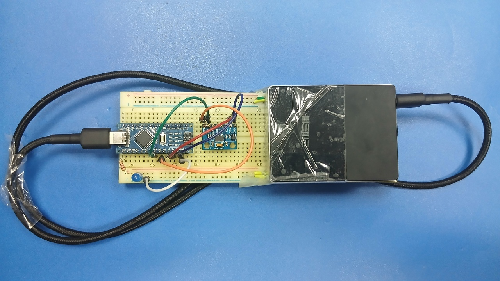

# Задание "Акселерометр_невесомость"

## Формулировка задания

> Реализуйте устройство, которое покажет невесомость. В домашних условиях ее можно, кратковременно добиться, если подбросить объект, вверх. поле достижения максимальной точки и начала движения вниз, объект будет кратковременно находиться в состоянии невесомости. Используйте повербанк, устройство не должно быть соединено проводом. Сигнализирование о невесомости можно сделать при помощи светодиода.

## Демонстрация работы

### Фото реализации

### Видеодемонстрация

Ссылка на [видео](https://drive.google.com/file/d/1OMx0hH270RJkTzS8TkQ_Gw6rOBJsei0z/view?usp=sharing).