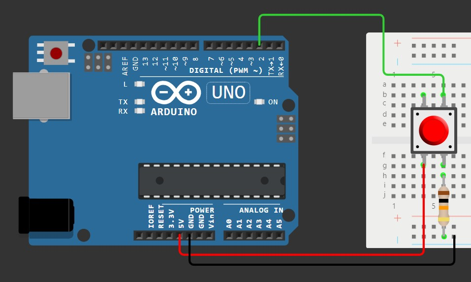

# BounceProcessing

## Формулировка

> Допишите код ниже, чтобы правильно обрабатывать дребезг - код дает только реальные нажатия. А так же время удержания кнопки.

## Демонстранция работы

Ссылка на [видео](https://drive.google.com/file/d/163b8CFPLbVB1avMwS8gsa5pmRH3cLjnn/view?usp=sharing)

## Схема

Ссылка на [схему](https://wokwi.com/projects/421857815438833665)

