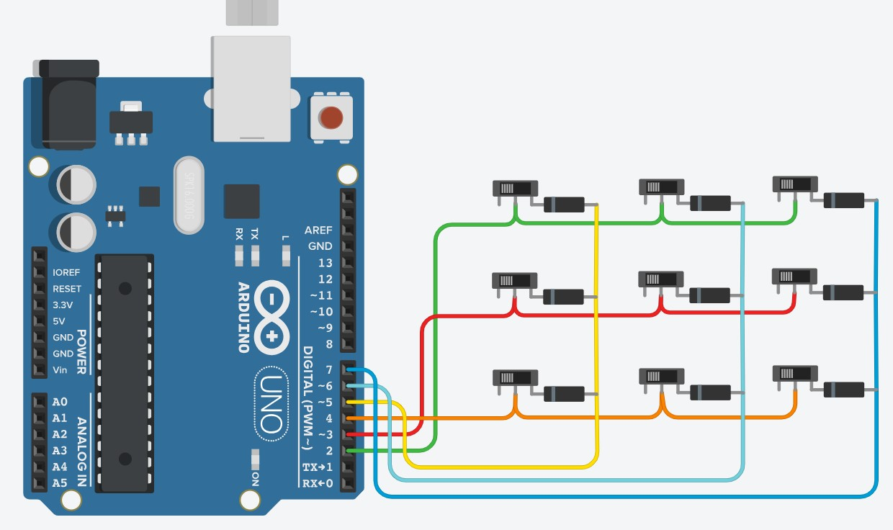

# ButtonMatrix

## Формалировка задания

Реализуйте детектирование нажатий пользователя.

0) (3 балла) Реализуйте работу с кнопками используя регистры PIN# и PORT#, что позволит избавиться от внутренних циклов в update_button_state(). Внешний цикл ( for(int irow = 0; irow < NROWS; irow++) ) реализовать с помощью таймеров.

1) (2 балла) В serial monitor нужно выводить информацию, только при смене события - нажатие кнопки, которая не была нажата или отпускание кнопки, которая была нажата.

2) (2 балла) Нужно вести учет длительности и начала нажатия нажатия каждой из кнопок. Выводите его после того как кнопка была отпущена.

## Схема

## Демонстрация работы

Ссылка на [видео](https://drive.google.com/file/d/19hkY9QlODm9VjrLoliqdJ_6pmEQUxxck/view?usp=sharing).