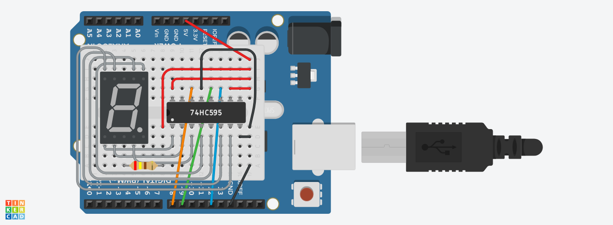

# Задание "Калибровка Движения"

## Формулировка задания

>  В этом задании, Вам нужно написать прошивку, которую можно использовать для калибровки движения без перепрошивки. Для этого мы будем использовать Bluetooth модуль, который мы будем использовать как UART, работающий по воздуху, и приложение, которое предоставляет соединение  с bluetooth модулем. В приложении нам понадобиться вариант взаимодействия  gamepad. Используйте кнопки X, B, A, Y, <, >, ^, v для того, чтобы пользователь смог откалибровать движение:

## Интерфейс калибровки

### Режимы калибровки

В нашем интерфейсе реализовано три режима калибровки: 
1) Калибровка направления движения.
2) Калибровка скорости вращения колес.
3) Калибровка времени поворота на 90, 180, 270 и 360 градусов.

Переключение между режимами калибровки происходит с помощью кнопок `START` и `PAUSE`.

`START` - предыдущий режим калибровки.

`PAUSE` - следующий режим калибровки.

### Движение

Для управления колесной платформой используются кнопки `<`, `>`, `^`, `v`. 

### Калибровка

Для переключения объекта калибровки (например, для переключения калибровки движения вперед на калибровку движения назад) используются кнопки `□` и `○`.

`□` - предыдущий объект калибровки.

`○` - следующий объект калибровки.

Для калибровки параметров, например скорости вращения колеса, в каждом режиме используются кнопки `▲` и `✖`

## Демонстрация

Ссылка на видео.

Ссылка на схему [7-сегментного индикатора](https://www.tinkercad.com/things/gLiCHLp4rRI-movementcalibration?sharecode=FIZoucqgbehtAHTuPNxtiv_5d5W9BxQ_eagK8G9BR3M).

