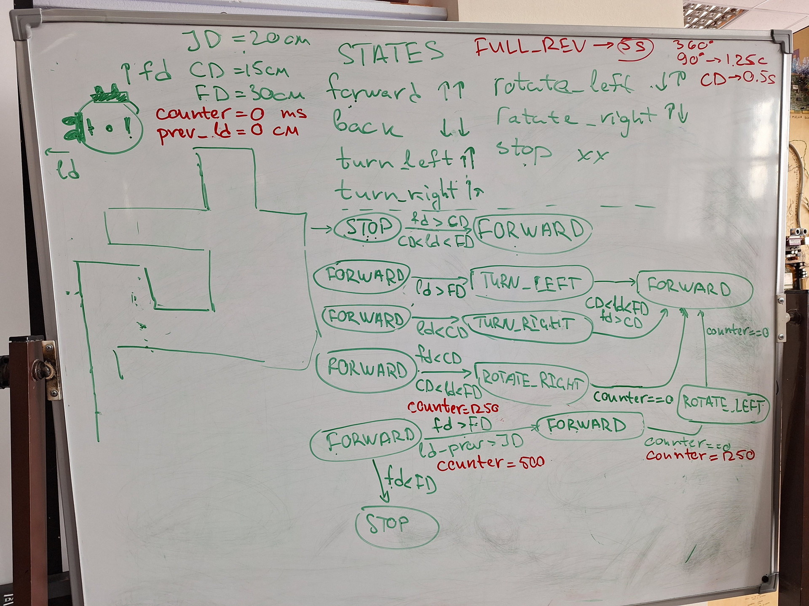
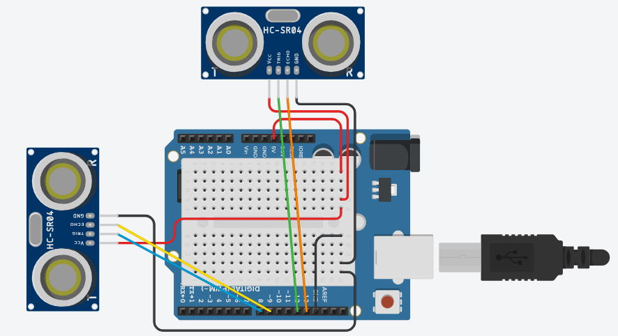

# Задание "	StateMachine"

## Формулировка задания

> Разработать машину состояний для задачи следования по периметру в лабиринте. Реализовать обход периметра в лабиринте.

### Схема

Ссылка на [схему](https://www.tinkercad.com/things/hncRLyT5URT-statemachine).

### Демонстрация работы
Демонстрация 1 [видео](https://drive.google.com/file/d/1Rba4v70OTCIPMiyM0O1oPaeIBzu0ZjOp/view?usp=sharing).
Демонстрация 2 [видео](https://drive.google.com/file/d/17YSq3zJRHK-1AGRbgy8uu34W2ZA4afLA/view?usp=sharing).
