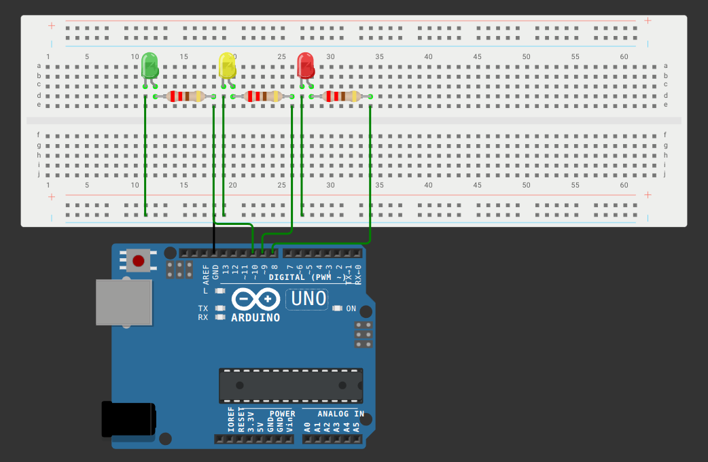

# Задание "Светофор"

## Формулировка

> Подключить три светодиода, красный, зеленый и желтый. Если нет желтого светодиода, синий выполняет роль желтого сигнала светофора.  Запрограммировать автоматический режим работы светофора: зеленый (10 с) - мигающий зеленый (2 с) - желтый (1с) - красный (7 с) - желтый (1с) - зеленый (10 с). Добавить возможность перевода на ручное управление через команду с ПК: запрос на перевод (одна команда) и режим в котором светофор будет работать зеленый или красный (вторая команда). Если текущий режим не соответствует запрошенному, сделать перевод в него через желтый (3с). Ограничить ручной режим на 60 секунд - далее происходит возврат к автоматическому режиму даже если запроса на возврат не было. В коде не должно быть задержек (delay).

## Детали реализации

Все константы и глобальные переменные вынесены перед объявлением всех функций. Программа написана без использования функции `delay()`, а с помощью переменных, которые определяют актуальный режим программы, а также функции `millis()` для отсчёта времени исполнения блоков программы.

Пины светодидов:

| Цвет    | pin |
| ------- | --- |
| красный | 8   |
| жёлтый  | 9   |
| зелёный | 10  |

Для упрощения тестирования ограничение ручного режима сокращено с 60 до 15 секунд.

Команды, вводимые в консоль Serial:

* `c`: меняет режим программы с автоматического на ручной, и наоборот;
* `r`: в ручном режиме меняет горящий зелёный сигнал светофора на красный;
* `g`: в ручном режиме меняет горящий красный сигнал светофора на зелёный.

При вводе команд `r` и `g`, если сигнал светофора меняется, сначала на 3 секунды горит жёлтый сигнал.

## Видео демонстрация работы

На видео дальний синий светодиод имитирует красный сигнал, а ближайший синий - зелёный сигнал.

Ссылка на [видео](https://drive.google.com/file/d/1KDI8BASS1SfNDQRjzP32feaMHouLWmA1/view?usp=sharing).

## Схема решения

Ссылка на [схему](https://wokwi.com/projects/410461812584381441).

